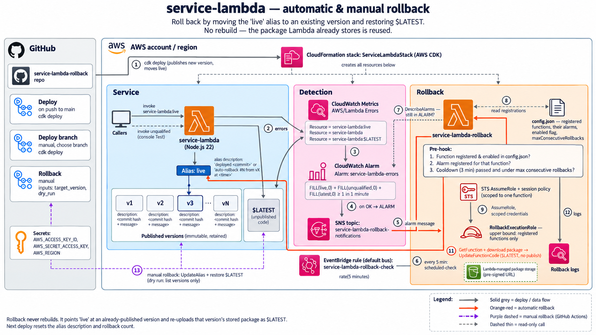

# service-lambda-rollback

An AWS CDK app with a Lambda function (`service-lambda`) and a rollback system for it, both automatic
and manual. A rollback never rebuilds anything: it points the `live` alias at an already-published
version and re-uploads that version's stored package as `$LATEST`.



## How it works

**Deploy.** Every deploy that changes the function's code or configuration publishes a new, immutable
version and moves the `live` alias to it. Old versions are kept. Each version's description is the
last commit that touched `lambda/`.

**Automatic rollback.**

1. The CloudWatch alarm `service-lambda-errors` fires when there is at least 1 error in a minute on
   `service-lambda:live` or `$LATEST`.
2. The alarm publishes to the SNS topic `service-lambda-rollback-notifications`, which invokes
   `service-lambda-rollback`.
3. A pre-hook checks `lambda-rollback/config.json`: the function must be registered and enabled, and
   the alarm must be registered for it. It also enforces a 3-minute cooldown and a limit on
   consecutive rollbacks.
4. The rollback function gets temporary credentials scoped to that single function (STS `AssumeRole`
   with a session policy).
5. It moves `live` to the previous version and restores `$LATEST` to that version's code.

CloudWatch only notifies when an alarm changes state. If the version rolled back to also fails, the
alarm stays in `ALARM`, so the EventBridge rule `service-lambda-rollback-check` re-checks registered
alarms every 5 minutes and rolls back again if needed.

**Manual rollback.** The `Rollback` GitHub Actions workflow does the same with the AWS CLI. Leave
`target_version` empty to go back one version, or enter a specific version. Tick `dry_run` to only
list the versions (with their commit descriptions) and see what would happen.

## Repository layout

| Path | Contents |
|---|---|
| `bin/app.ts` | CDK app entry point |
| `lib/service-stack.ts` | The stack: `service-lambda`, alias, alarm, SNS topic, EventBridge rule, rollback function, IAM |
| `lambda/` | `service-lambda` code (logs the version it runs as) |
| `lambda-rollback/index.mjs` | Rollback function |
| `lambda-rollback/config.json` | Functions registered for automatic rollback |
| `.github/workflows/` | `Deploy`, `Deploy branch`, `Rollback` |
| `docs/` | Cost estimate, architecture diagram and the prompt used to generate it |

## Workflows

| Workflow | Trigger | What it does |
|---|---|---|
| `Deploy` | Push to `main` (except `.md` / `docs/` only changes), or manual | `cdk deploy` |
| `Deploy branch` | Manual, choose a branch | `cdk deploy` from that branch |
| `Rollback` | Manual, inputs `target_version` and `dry_run` | Moves `live` back and restores `$LATEST`; dry run only lists versions |

All three need these GitHub repository secrets: `AWS_ACCESS_KEY_ID`, `AWS_SECRET_ACCESS_KEY`,
`AWS_REGION`.

## Registering a function for automatic rollback

Edit `lambda-rollback/config.json` and deploy:

```json
{
  "maxConsecutiveRollbacks": 2,
  "functions": [
    { "name": "service-lambda", "enabled": true, "alarms": ["service-lambda-errors"] }
  ]
}
```

- **Register:** add an entry with the function name and the alarms allowed to trigger its rollback.
- **Deregister:** set `"enabled": false`, or remove the entry.

The function must publish versions and have an alias, and its alarm must send to
`service-lambda-rollback-notifications`. Permissions and the scheduled check are generated from this
file.

## Setup

```sh
npm ci
npx cdk bootstrap   # once per account/region
npx cdk deploy
```

## Things to know

- Call the function through its alias (`service-lambda:live`). The rollback also restores `$LATEST`'s
  code, but not its configuration.
- After a rollback, `$LATEST` no longer matches git until the next deploy that changes `lambda/`.
- A deploy resets the alias description, which also resets the consecutive-rollback count.

## More docs

- [Cost estimate for 500 functions](docs/COSTS.md)
- [Architecture diagram prompt](docs/ARCHITECTURE_IMAGE_PROMPT.md)
